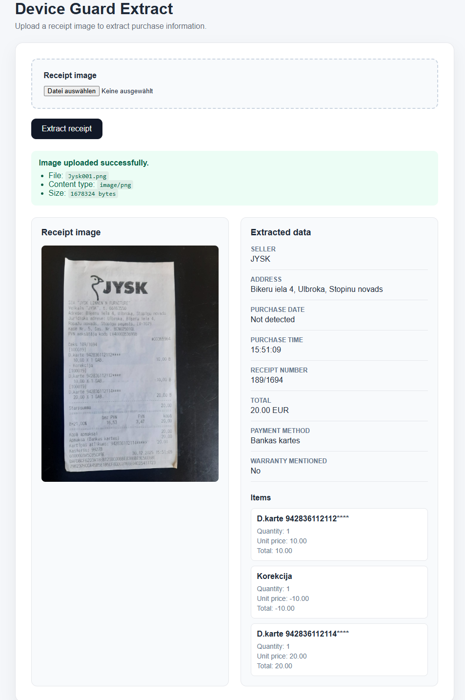

# Device Guard Extract

> AI-powered receipt extraction with Spring Boot, Spring AI and OpenAI Vision.

Device Guard Extract turns receipt images into structured purchase information.

Upload a photo of a receipt, preview it in the browser and extract seller details, purchase date, total amount, payment method and purchased items.


---

## About the project

Device Guard started as a school accelerator project.

The original idea was to help users preserve purchase information, warranty details and device history. Paper receipts are easy to lose, fade over time and are difficult to search.

This repository demonstrates the AI-based receipt extraction component of Device Guard.

The application uses an OpenAI vision-capable model through Spring AI to convert a receipt image into a typed Java object.

The extracted data remains reviewable and can later be corrected manually, enriched with warranty information and stored as part of a device inventory.

---

## Features

- Upload receipt images through a web interface
- Preview uploaded images
- Extract structured receipt information with AI
- Detect seller name and address
- Extract purchase date and time
- Extract receipt number
- Extract total amount and currency
- Detect payment method
- Extract purchased items
- Detect explicitly printed warranty information
- Interpret dates according to receipt language and country
- Reject invalid and future purchase dates
- Check application health without calling OpenAI
- Verify the OpenAI connection through a dedicated ping endpoint
- Run locally with Maven or Docker

---

## Current workflow

```text
Receipt image
      |
      v
Thymeleaf upload form
      |
      v
Spring MVC MultipartFile
      |
      v
Spring AI / OpenAI Vision
      |
      v
ReceiptExtraction DTO
      |
      v
Validation
      |
      v
Rendered extraction result
```

---

## Screenshot


```markdown


---

## Example extraction

A receipt image can produce a result similar to:

```json
{
  "sellerName": "EDEKA",
  "sellerAddress": "Stuttgarter Str. 46-48, 70469 Stuttgart",
  "receiptLanguage": "de",
  "receiptCountry": "DE",
  "purchaseDateRaw": "04.07.2026",
  "purchaseDate": "2026-07-04",
  "purchaseTime": "14:18:00",
  "receiptNumber": "17946273",
  "totalAmount": 49.47,
  "currency": "EUR",
  "paymentMethod": "EC-Cash",
  "warrantyMentioned": false
}
```

The AI extracts data visible on the receipt. Critical values should still be reviewed before being stored permanently.

---

## Technology stack

- Java 21
- Spring Boot 4
- Spring AI 2
- OpenAI API
- Thymeleaf
- Maven
- Docker
- Docker Compose

---

## Project structure

```text
Device-Guard-Extract
├── .mvn
├── src
│   ├── main
│   │   ├── java
│   │   │   └── com.thrivingcoders.deviceguard.extract
│   │   │       ├── ai
│   │   │       │   ├── AiController.java
│   │   │       │   ├── AiExceptionHandler.java
│   │   │       │   ├── AiService.java
│   │   │       │   └── HealthController.java
│   │   │       ├── receipt
│   │   │       │   ├── ReceiptAiService.java
│   │   │       │   ├── ReceiptExtraction.java
│   │   │       │   ├── ReceiptExtractionValidator.java
│   │   │       │   ├── ReceiptPageController.java
│   │   │       │   └── ReceiptPrompt.java
│   │   │       └── DeviceGuardExtractApplication.java
│   │   └── resources
│   │       ├── templates
│   │       │   └── receipt-upload.html
│   │       └── application.yaml
│   └── test
├── .env.example
├── .gitignore
├── Dockerfile
├── docker-compose.yml
├── mvnw
├── mvnw.cmd
├── pom.xml
└── README.md
```

---

## Requirements

For local development:

- Java 21
- Internet connection
- OpenAI API key with available API credit

For Docker:

- Docker Desktop or another running Docker Engine
- Docker Compose

An OpenAI API key is required only for endpoints that call the AI model.

---

## Configuration

Create a local `.env` file in the project root:

```env
OPENAI_API_KEY=replace-with-your-openai-api-key
```

The `.env` file is excluded from Git and must never be committed.

An example configuration is provided in:

```text
.env.example
```

---

## Running locally with Maven

### 1. Clone the repository

```bash
git clone https://github.com/DeriuginaKristina/Device-Guard-Extract.git
cd Device-Guard-Extract
```

### 2. Configure the API key

Copy the example file:

```bash
cp .env.example .env
```

On Windows Command Prompt:

```cmd
copy .env.example .env
```

Then add your key to `.env`:

```env
OPENAI_API_KEY=replace-with-your-openai-api-key
```

### 3. Start the application

Linux, macOS or Git Bash:

```bash
./mvnw spring-boot:run
```

Windows Command Prompt or PowerShell:

```powershell
.\mvnw.cmd spring-boot:run
```

### 4. Open the application

```text
http://localhost:8080/
```

---

## Running with Docker Compose

Docker Compose reads the `OPENAI_API_KEY` value from the local `.env` file.

Build and start the application:

```bash
docker compose up --build
```

Open:

```text
http://localhost:8080/
```

Stop the application:

```bash
docker compose down
```

Run in the background:

```bash
docker compose up --build -d
```

View logs:

```bash
docker compose logs -f
```

---

## Running with Docker directly

Build the image:

```bash
docker build -t device-guard-extract .
```

Run it using the local `.env` file:

```bash
docker run --rm \
  --name device-guard-extract \
  --env-file .env \
  -p 8080:8080 \
  device-guard-extract
```

Git Bash on Windows accepts the same multiline command.

PowerShell:

```powershell
docker run --rm `
  --name device-guard-extract `
  --env-file .env `
  -p 8080:8080 `
  device-guard-extract
```

---

## Endpoints

### Web interface

```http
GET /
```

Displays the Thymeleaf receipt upload page.

### Receipt extraction

```http
POST /receipts/extract
```

Accepts a receipt image as `multipart/form-data`.

Supported formats:

- JPEG
- PNG
- WebP

Maximum upload size:

```text
10 MB
```

### Application health

```http
GET /health
```

Example response:

```json
{
  "status": "UP"
}
```

This endpoint verifies that the application is running. It does not call OpenAI and does not consume tokens.

### OpenAI connectivity check

```http
GET /api/ai/ping
```

Example response:

```text
Device Guard AI connection works
```

This endpoint performs a real OpenAI request and therefore consumes a small number of tokens.

---

## Data handling

Receipt images are currently processed in memory.

The demo implementation:

- does not store uploaded images in a database;
- does not save uploaded images to the local filesystem;
- sends receipt content to the configured OpenAI API project for extraction;
- returns the extracted result directly to the Thymeleaf page.

OpenAI content-sharing options should remain disabled when working with confidential, personal or third-party receipt data.

Do not upload content that you are not authorized to process.

---

## Date handling

Receipt dates can appear in different regional formats:

```text
30.06.2026
30.06.26
06/30/2026
2026-06-30
```

The extraction process considers:

- receipt language;
- probable country;
- regional date conventions;
- original printed date;
- normalized ISO date;
- current date.

The normalized value uses:

```text
YYYY-MM-DD
```

Dates that cannot be validated or that lie in the future are rejected instead of being accepted silently.

---

## Limitations

This is an experimental extraction component, not a financial or accounting system.

AI results can be incorrect when:

- the receipt is blurred;
- text is partly hidden;
- the image is rotated or poorly lit;
- the receipt is damaged;
- the receipt contains ambiguous numbers;
- seller information is not printed;
- date conventions cannot be identified reliably.

Extracted values should be reviewed before being stored or used for warranty, tax or accounting purposes.

---

## Roadmap

- [x] OpenAI integration
- [x] AI connectivity endpoint
- [x] Thymeleaf receipt upload page
- [x] Receipt image preview
- [x] Structured AI extraction
- [x] Locale-aware date extraction
- [x] Future-date validation
- [x] Docker support
- [ ] Automated tests for receipt date normalization
- [ ] Editable extraction form
- [ ] Manual correction and confirmation workflow
- [ ] Warranty period management
- [ ] Extended warranty support
- [ ] PDF receipt support
- [ ] Persistent purchase storage
- [ ] Device inventory management
- [ ] Cost and token usage reporting
- [ ] Continuous integration with GitHub Actions

---

## Security notes

Never commit:

```text
.env
```

Never hard-code an API key in:

- Java source files;
- `application.yaml`;
- `Dockerfile`;
- `docker-compose.yml`;
- README examples;
- GitHub commits.

If a key is accidentally published, revoke it immediately and create a new one.

---

## Website

Thriving Coders:

```text
https://thriving-coders.com/
```

Repository:

```text
https://github.com/DeriuginaKristina/Device-Guard-Extract
```

---

## Project status

The current repository is a working proof of concept.

It demonstrates that Spring AI can receive a receipt image, call an OpenAI vision-capable model and map the response into structured Java data.

Further development will be evaluated after the extraction quality, privacy model and intended product scope have been reviewed.
